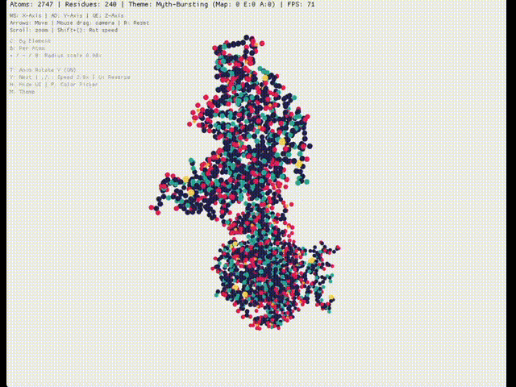

# protdot



Interactive protein structure viewer that represents atoms or residues as colored dots (powered by Rust with [Macroquad](https://macroquad.rs/)).

`protdot` loads a PDB structure, centers it, and renders atoms or residues with multiple coloring and animation modes for quick visual inspection.

## Features

- Native desktop and WebAssembly builds
- Browser-embeddable viewer controls and host-page JavaScript API
- Per-atom and per-residue rendering modes
- Multiple coloring modes:
	- by element
	- by amino-acid group
	- by amino-acid type
	- N→C gradient
	- seeded random chain colors
	- active theme colors
- Theme and mapping cycling at runtime
- Optional custom color palettes from `color_palette.yaml` (desktop)
- Built-in color picker UI for live color tuning
- PNG and SVG export on desktop build
- Runtime browser loading from pasted PDB text, remote URLs, local file input, and drag/drop

## Quick Start

### Run on desktop

```bash
cargo run --release -- data/1G2F.pdb
```

```bash
# Build and run
cargo build --release
./target/release/protdot data/1G2F.pdb
```

If no file is provided, native builds default to `data/default.pdb`.

### Build and run in browser

```bash
./build_wasm.sh
cd docs
python3 -m http.server 8000 # or similar static file server of your choice (http-server, etc.)
```

Open `http://localhost:8000`.

Notes:
- Web builds load `data/default.pdb` embedded at compile time.
- `build_wasm.sh` compiles `target/wasm32-unknown-unknown/release/protdot.wasm` and copies it into `docs/`.
- Browser controls in `docs/index.html` can swap structures at runtime without rebuilding the WASM binary.

### Browser host API

The web viewer exposes a global `window.ProtdotViewer` helper for host pages and notebook wrappers.

Examples:

```js
await window.ProtdotViewer.loadPdbUrl("https://files.rcsb.org/download/1CRN.pdb");
window.ProtdotViewer.loadPdbText(pdbText, "My structure");
window.ProtdotViewer.setColorScheme(5);   // Theme
window.ProtdotViewer.setRenderMode(1);    // Per residue
window.ProtdotViewer.setThemeIndex(3);
window.ProtdotViewer.setRadiusScale(0.6);
window.ProtdotViewer.resetView();
```

## Usage

### Input files

Accepted input is standard PDB text with `ATOM` records. Example files are included in `data/`.

## Controls

Press `H` to show/hide the in-app overlay.

### Camera and transform

- Left mouse drag: orbit camera
- Middle mouse drag: pan
- Mouse wheel: zoom
- `W` / `S`: rotate model around screen X-axis
- `A` / `D`: rotate model around screen Y-axis
- `Q` / `E`: rotate model around screen Z-axis
- Arrow keys: translate model in screen space
- `R`: reset visualization state (color mode, render mode, scale, transforms)

### Visual modes

- `C`: cycle color scheme
	- By Element → By AA Group → By AA Type → N→C Gradient → Random Chain → Theme
- `B`: toggle render mode (`PerAtom` / `PerResidue`)
- `M`/ `Shift+M`: next/previous theme 
- `N`/`Shift+N`: next/previous color mapping
- `+` / `-`: increase/decrease atom/residue radius scale

### Animation

- `T`: toggle animation
- `Y`: cycle animation mode
	- None → Rotate Y → Rotate X → Rotate Z → Rotate XY → Orbit → Figure-8 → Wobble → Tumble
- `,` / `.`: decrease/increase animation speed
- `U`: reverse animation direction

### UI and color editing

- `H`: toggle info overlay
- `P`: toggle color picker panel

Color picker controls:
- `Tab`: switch category (`Background`, `Elements`, `AA Groups`)
- `J` / `K`: move item selection
- `1` / `2`: decrease/increase red channel
- `3` / `4`: decrease/increase green channel
- `5` / `6`: decrease/increase blue channel

### Export (desktop only)

- `X`: export PNG to `protein_export.png`
- `V`: export SVG to `protein_export.svg`

## Custom Themes and Palette Configuration

On native builds, `protdot` tries to merge `color_palette.yaml` into the active theme at startup.

Built-in palette inspirations are sourced from https://www.schemecolor.com.

You can:
- override base mappings (`elements`, `amino_acid_groups`, `amino_acid_types`, `gradient`)
- define additional named themes under `themes:`
- set per-theme `background`

YAML-defined themes are inserted before built-in themes, so they appear first when cycling with `M`.

Color format supports:
- `#RRGGBB`
- `#RRGGBBAA`

## Known Limitations

- Parser currently processes `ATOM` lines (not a full strict PDB parser).
- Missing/invalid PDB path on native build will panic with file-read error.
- Web build starts with an embedded default structure.
- Browser URL loading depends on remote CORS policy.
- SVG export is a 2D projection (not a full scene graph export).

## License
MIT License